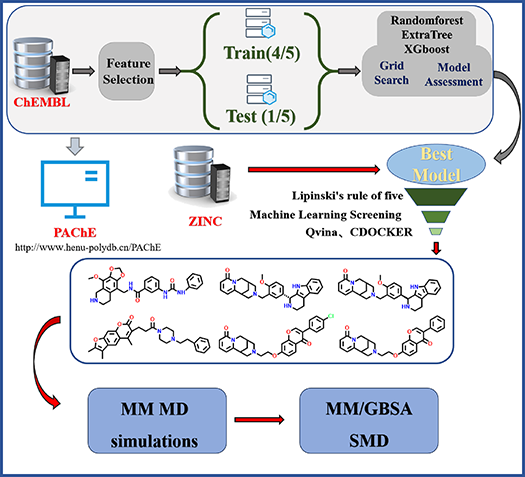

# PAChE
Acetylcholinesterase (AChE) inhibitors are recognized as a viable therapeutic strategy for Alzheimer's disease (AD). In this study, a discriminator based on machine learning is developed to identify compound structures with AChE inhibitory activity exceeding 5 μM, leading to the creation of a web service named PAChE. Additionally, a high-throughput screening approach is applied to the natural product database sourced from ZINC, utilizing a combination of drug-like principles, molecular docking, and machine learning discriminators. The scheme identifies six compound molecules with potential inhibitory activity. Molecular dynamics simulations are then employed to assess the static and dynamic binding of these candidate compounds. The findings indicate that all six compounds exhibit favorable static binding and dynamic binding capabilities.

